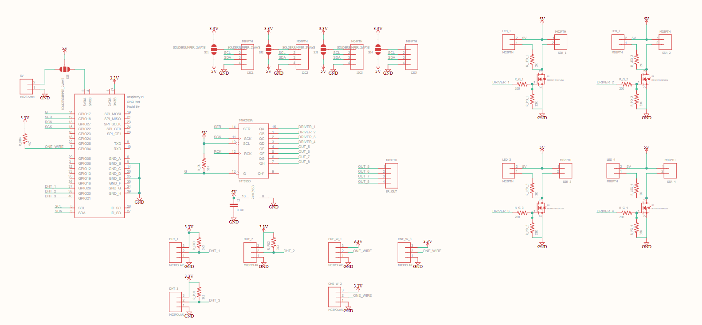
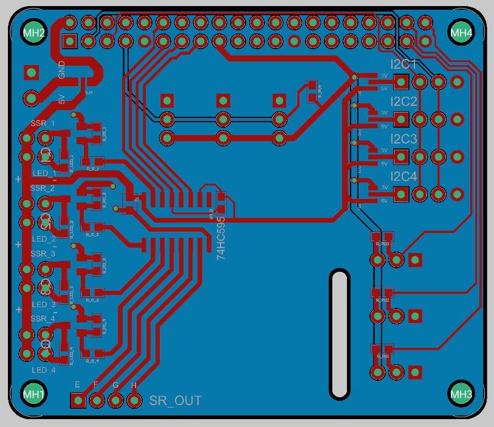

# greenhouse_controller

## Executive Summary

An edge-based IoT monitoring and irrigation control system designed for long-term autonomous operation. 
The system integrates custom hardware (Raspberry Pi HAT), environmental sensors, actuator control (relays/SSR), event-driven automation logic, 
and a web-based monitoring interface built with Django. 
Deployed in real-world conditions and operated continuously for multiple years.

## Introduction

Greenhouse Controller is a self-contained monitoring and irrigation control system for long-term autonomous operation in a home environment.
It includes a web interface for viewing state and setting up the system

## System Architecture

The system follows an edge-controller architecture:

Sensors → Custom HAT Board → Raspberry Pi (Edge Controller) → Django Backend → Web Interface

- Local sensing and actuation handled directly by the Raspberry Pi.
- Control logic executed locally (no cloud dependency).
- Web interface for monitoring, configuration, and manual override.
- SQLite-based data storage with lightweight retention strategy.

## Key Engineering Decisions

- Used 74HC595 shift register to expand GPIO outputs efficiently.
- Designed custom PCB HAT for reliable sensor and actuator interfacing.
- Separated measurement database from backup storage to mitigate SD-card wear and performance limitations.
- Implemented event-condition-action flow engine for flexible automation logic.
- Ensured safe driving of relays via transistor stages and current-limited LED indicators.

  
## Overview
The project includes interfacing with temperature, homidity and light sensors.
Controlling relays that can controll water flow or other outputs.
Interfacing with a camera to save ongoing still images.

The architecture was designed for running on a raspberry pi, using its IOs through a dedicated hat board that interfaces directrly with sensors and relays.
key points:
1. to expand the output amount of the digital IOs a 74HC595A shift register was used.
3. the board includes:
   1. connector for external 5V power that can run the board and/or the hat (controlled with a soldered jumper)
   2. 4 outputs that can controll a SSR/ Relay with connectors for an indicater LED (board includes a current limiting resistor)
   3. 4 outputs of raw digital pins from the shift register (no LED/ Driver/ protection)
   4. 4 connectors for an I2C sensors, conenctors include the communication pins (sca,sda) and a 3.3/4V supply selected with a soldered jumper
   5. 3 dedicated connectors for a "Maxim Integrated DS18B20" 1-wire thermometer
   6. 3 dedicated connectors for a "AM2302/DHT22" digital temperature and humidity sensor
   7. pins for interfacing with all the Rpi GPIOs (40p connector)
   8. pads for the shift register, driving transistors, and passive components

The project was built usind the Dgango python library that implements the backend and frontend.
Drivers for interacting with some sensors were implemented or if were already implemented, open source implementations were used.
for example:
1. Maxim Integrated DS18B20 thermometer
2. AM2302/DHT22 tmperature and humidity sensor
3. generic water flow sensor (pulse per known amount of flow)
4. TSL2561 Lux sensor
5. generic digital Input/ Output lines (can be used for level sensors etc.)
6. a camera driver (uses the Rpi camera interface)
   
## hat board schematic and layout

## Controll options
The project implements an "Event -> Condition -> Action" Flow. 
Events can be configured (for example and event when a certain time elapses), 
conditions can be configures (only do X if ...) and actions can be configured (for example, change state of relay "Y").

an example watering flow can be:
- at 8:00 of days 1,3,5:
	- turn ON relay A
	- wait 10 minutes
	- turn OFF relay A

another flow can be to save sensor images to a DB:
- avery 5 minutes:
  - read sensor A, save value to DB
  - read sensor B, save value to DB
  - ...
 
## web UI

The django admin interface can be used to create new flows (events, actions and conditions) (or this can be done via a python script upon deploying
The web interface includes views of current sensors values current relays states, last image from the camera and more.
There also a manual operation page for manually controlling things (without using flows)

## Lessons Learned

### Edge System Constraints
- SD-card wear and limited I/O throughput require careful database management.
	- All measurements from db.sqlite above some number (64K?) are moved to another db backup.sqlite3
 	- backup.sqlite3 can be copied regularly to a strong computer
- Power stability is critical when driving inductive loads.

### Reliability
- Long-running systems require watchdog-like recovery strategies.
- Sensor drift and environmental exposure must be handled in software logic.

### Hardware–Software Integration
- Clear abstraction layers between hardware drivers and application logic simplify long-term maintenance.
  

